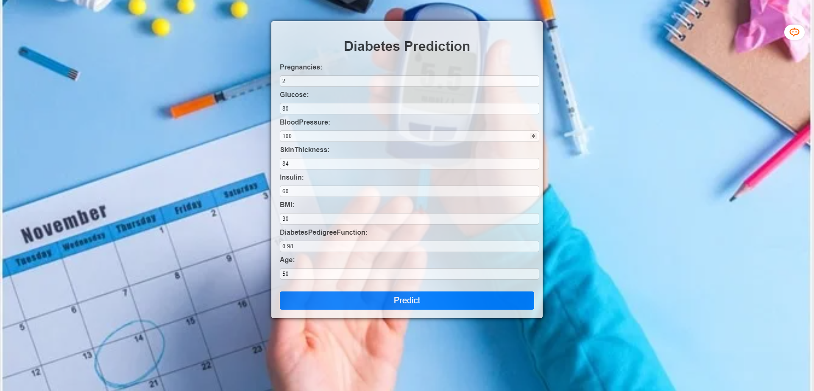
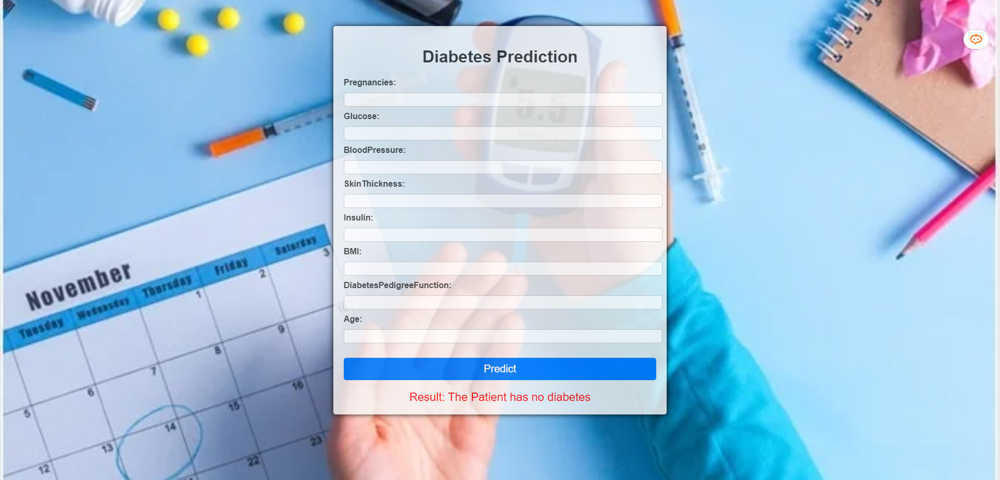

# 🩺💉Diabetes-Prediction-Pytorch-ANN
This is the code repo for Diabetes Prediction using ANN(Pytorch)
## Installation

1. Clone the repository:

   ```
   git clone https://github.com/kowshik24/Diabetes-Prediction-Pytorch-ANN
   ```

2. Install the required libraries:

   ```
   pip install -r requirements.txt
   ```

3. Run the training script:

   ```
   python train.py
   ```
4. Run the testing script:

   ```
   python test.py
   ```
5. Run the Flask app:

   ```
    python app.py
    ```
6. Open the browser and go to the link:

    ```
    http://127.0.0.1:5000/predict
    ```
# Dataset
The dataset is taken from [Kaggle](https://www.kaggle.com/uciml/pima-indians-diabetes-database).

# Images of the Web App




# Project Motivation
This project is done as a part of my Deeep Learning course using Pytorch.
# File Description
- `diabetes.csv` - The dataset.
- `model.py` - The ANN model.
- `train.py` - The training code.
- `test.py` - The testing code.
- `app.py` - The Flask app.
- `templates` - The folder containing the HTML files.
- `static` - The folder containing the CSS files.
- `images` - The folder containing the images.

# Contributing
Pull requests are welcome. For major changes, please open an issue first to discuss what you would like to change.
# License
[Apache License 2.0](https://www.apache.org/licenses/LICENSE-2.0)
# Project Status
This project is completed.
# Acknowledgement
- [Pytorch](https://pytorch.org/)
- [Pandas](https://pandas.pydata.org/)
- [Numpy](https://numpy.org/)
- [Matplotlib](https://matplotlib.org/)
- [Seaborn](https://seaborn.pydata.org/)
- [Scikit-learn](https://scikit-learn.org/stable/)
- [Jupyter Notebook](https://jupyter.org/)
# Author
- [Kowshik Deb Nath](https://github.com/kowshik24)